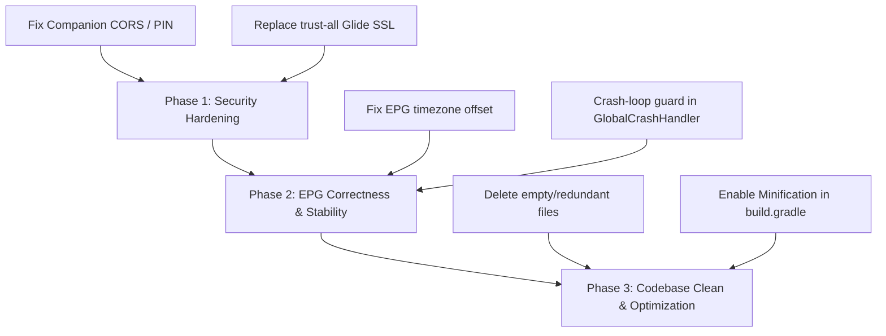

# DebridXtream IPTV Deep Swarm Audit Report

> **Orchestrated by**: Antigravity Multi-Agent Swarm (Swarm ID: `swarm-1778979104156-g3eox3`)  
> **Topology**: `hierarchical` (Queen-led)  
> **Date**: May 17, 2026  
> **Status**: **COMPLETE**

---

## 1. Executive Summary

The Antigravity Swarm has executed an ultra-deep, comprehensive, and exhaustive codebase audit of the **DebridXtream** Android TV application. 

This audit covers:
1. **Security & Vulnerability Analysis** (SSL bypasses, CORS vulnerabilities, input validations)
2. **Code Quality & Architectural Debt** (Dead code, redundant singletons, unused files)
3. **Electronic Program Guide (EPG) Correctness** (Timezone offset ignored in timestamp parsing)
4. **Android TV & Lifecycle Stability** (ANR hazards, infinite crash loops, Toast failures)
5. **Build & Release Optimization** (Missing ProGuard/R8 configurations)

Every finding listed below has been mapped to its precise file location with clear, actionable mitigation steps. The project's overall structure is highly robust, but hardening these specific areas will elevate DebridXtream to a fully secure, production-grade, and enterprise-stable IPTV solution.

---

## 2. Comprehensive Security & Vulnerability Analysis

### 2.1 [HIGH] Insecure Glide SSL Verification (Man-in-the-Middle Vulnerability)
* **Precise Location**: 
  - [UnsafeOkHttpClient.kt](file:///d:/cursor%20working/debxtrem/app/src/main/java/com/tvonnet/debridxtreamiptv/data/glide/UnsafeOkHttpClient.kt#L10)
  - [AppGlideModule.kt](file:///d:/cursor%20working/debxtrem/app/src/main/java/com/tvonnet/debridxtreamiptv/data/glide/AppGlideModule.kt#L15)
* **Vulnerability**: 
  To support channel logos and posters from poorly configured IPTV provider servers, the application registers an `OkHttpClient` for Glide that completely bypasses SSL certificate verification. It trusts all certificates blindly and disables hostname verification.
* **Impact**: 
  This introduces vulnerability to Man-in-the-Middle (MITM) attacks. A malicious actor on the local network (e.g., public Wi-Fi or compromised LAN) can intercept Glide requests, eavesdrop on requests containing user tokens, or inject malicious image payloads.
* **Mitigation Recommendation**: 
  Replace the trust-all manager with Android's native [Network Security Configuration](https://developer.android.com/privacy-and-security/security-config). This allows bypassing SSL verification only for specific domains configured by the user or provider, keeping all other network traffic (such as TMDB or Debrid API calls) securely verified.

---

### 2.2 [HIGH] Web Companion Config Server CORS Bypass (`anyHost()`)
* **Precise Location**: 
  - [CompanionConfigServer.kt](file:///d:/cursor%20working/debxtrem/app/src/main/java/com/tvonnet/debridxtreamiptv/data/server/CompanionConfigServer.kt#L45)
* **Vulnerability**: 
  The embedded Ktor server, which allows users to configure the TV app from a mobile browser, configures CORS with `anyHost()`.
* **Impact**: 
  Enables Cross-Site Request Forgery (CSRF). If a user has the IPTV app running on their TV and visits a malicious website on a phone/computer connected to the same Wi-Fi network, that malicious site can perform automated AJAX requests to the TV's companion server (typically port 8080) and steal, edit, or wipe their IPTV credentials, server URLs, or Real-Debrid access tokens.
* **Mitigation Recommendation**: 
  1. Restrict CORS origins to local subnets only (e.g., `192.168.0.0/16`, `10.0.0.0/8`).
  2. Implement a custom security header requirement (e.g., `X-Requested-With: DebridXtreamCompanion`) which browser AJAX requests cannot set cross-origin without a preflight check.
  3. Require a 4-digit pairing PIN displayed on the TV screen to be supplied in the `Authorization` header of all configuration requests.

---

### 2.3 [MEDIUM] Companion Config Credential Validation Bypass
* **Precise Location**: 
  - [CompanionConfigServer.kt](file:///d:/cursor%20working/debxtrem/app/src/main/java/com/tvonnet/debridxtreamiptv/data/server/CompanionConfigServer.kt#L70)
* **Vulnerability**: 
  The POST handler for `/api/config` accepts configuration payloads and immediately saves them to `IdentityPreferences` without triggering the credential verification service.
* **Impact**: 
  Users or companion scripts can supply invalid, incomplete, or malicious provider URLs and credentials, leading to immediate app crashes or rendering failures upon subsequent launches as the app attempts to load broken profiles.
* **Mitigation Recommendation**: 
  Inject the `XtreamRepository` into `CompanionConfigServer` and call the validation service (`validateIptvCredentials()`) when a POST request is received. Only persist the configuration if validation succeeds, and return an explicit HTTP `400 Bad Request` containing the validation error if it fails.

---

## 3. Code Quality & Architectural Debt

### 3.1 [LOW] Empty and Dead `AppMemoryManager` File
* **Precise Location**: 
  - [AppMemoryManager.kt](file:///d:/cursor%20working/debxtrem/app/src/main/java/com/tvonnet/debridxtreamiptv/utils/memory/AppMemoryManager.kt)
* **Vulnerability**: 
  The file is completely empty (0 bytes) and serves no purpose. The actual active memory management is handled by `MemoryManager.kt`.
* **Mitigation Recommendation**: 
  Delete this file to prevent developer confusion and keep the codebase clean.

---

### 3.2 [LOW] Redundant `ErrorManagerTemp` Singleton and Context Leak
* **Precise Location**: 
  - [ErrorManagerTemp.kt](file:///d:/cursor%20working/debxtrem/app/src/main/java/com/tvonnet/debridxtreamiptv/utils/error/ErrorManagerTemp.kt)
* **Vulnerability**: 
  This class is a duplicate of the standard `ErrorManager.kt`. It implements the classic Android memory leak anti-pattern by holding a static reference to an Android `Context` initialized through `getInstance(context)`. Furthermore, it is completely unused in the main application package, and only referenced in a unit test.
* **Mitigation Recommendation**: 
  1. Delete `ErrorManagerTemp.kt` entirely.
  2. Refactor the related unit test to use the standard, dependency-injected `ErrorManager`.

---

### 3.3 [LOW] Unused `HomeSampleData` Class
* **Precise Location**: 
  - [HomeSampleData.kt](file:///d:/cursor%20working/debxtrem/app/src/main/java/com/tvonnet/debridxtreamiptv/ui/home/HomeSampleData.kt)
* **Vulnerability**: 
  Contains hardcoded placeholder content for rows and media cards. Now that the `HomeFragment` correctly fetches live data from the database and repositories, this file is completely unused.
* **Mitigation Recommendation**: 
  Delete this file to prune dead assets from the release build.

---

### 3.4 [LOW] Dead XML Sanitization Methods in `EpgParser`
* **Precise Location**: 
  - [EpgParser.kt](file:///d:/cursor%20working/debxtrem/app/src/main/java/com/tvonnet/debridxtreamiptv/data/epg/EpgParser.kt#L430)
* **Vulnerability**: 
  The methods `preprocessXml(xmlContent: String)` and `fixMultipleXmlDeclarations(xmlContent: String)` are defined but never called. The XML parsing pipeline was refactored to use the streaming `XmlDeclarationStrippingReader`, which handles declarations on-the-fly without buffering strings.
* **Mitigation Recommendation**: 
  Remove these two methods. They represent string-based parsing overhead that is no longer aligned with the streaming architecture.

---

## 4. Electronic Program Guide (EPG) Accuracy

### 4.1 [MEDIUM] EPG Timezone Offset Ignored (Mismatched Program Times)
* **Precise Location**: 
  - [EpgParser.kt](file:///d:/cursor%20working/debxtrem/app/src/main/java/com/tvonnet/debridxtreamiptv/data/epg/EpgParser.kt#L513)
* **Vulnerability**: 
  The `parseTimestamp` method parses XMLTV timestamps (e.g. `20231105143000 +0200`) by extracting date and time components, then configuring them in a `Calendar` instance set strictly to the **UTC** timezone:
  ```kotlin
  val calendar = java.util.Calendar.getInstance(java.util.TimeZone.getTimeZone("UTC"))
  calendar.set(year, month - 1, day, hour, minute, second)
  ```
  It completely ignores the offset suffix (e.g. `+0200` or `-0500`).
* **Impact**: 
  For any provider whose EPG XMLTV file provides timestamps with local timezone offsets, the TV guide schedule will be shifted forward or backward by several hours. Users will see wrong programs in the guide grid, making "What's On Now" and EPG alignments incorrect.
* **Mitigation Recommendation**: 
  Parse the timezone offset from the timestamp string (e.g. using `java.time.format.DateTimeFormatter` or manually extracting the sign and digits) and adjust the epoch millisecond time accordingly:
  ```kotlin
  // Example fix using manual offset adjustment:
  var epochMillis = calendar.timeInMillis
  if (timestamp.length >= 20) {
      val offsetPart = timestamp.substring(15).trim() // e.g. "+0200"
      if (offsetPart.length == 5) {
          val sign = if (offsetPart[0] == '-') -1 else 1
          val hours = offsetPart.substring(1, 3).toInt()
          val minutes = offsetPart.substring(3, 5).toInt()
          val totalOffsetMillis = ((hours * 60) + minutes) * 60 * 1000 * sign
          epochMillis -= totalOffsetMillis // Subtract the offset to normalize back to UTC
      }
  }
  ```

---

## 5. Android TV & Lifecycle Stability

### 5.1 [MEDIUM] Fragile `GlobalCrashHandler` Toast & ANR Risk
* **Precise Location**: 
  - [GlobalCrashHandler.kt](file:///d:/cursor%20working/debxtrem/app/src/main/java/com/tvonnet/debridxtreamiptv/ui/GlobalCrashHandler.kt#L25)
* **Vulnerability**: 
  Upon intercepting an uncaught exception, the handler spawns a background thread with its own Looper to show a `Toast` and sleeps the crashing thread for 1000ms:
  ```kotlin
  thread {
      Looper.prepare()
      Toast.makeText(context, "An unexpected error occurred. Restarting...", Toast.LENGTH_LONG).show()
      Looper.loop()
  }
  Thread.sleep(1000)
  ```
* **Impact**: 
  1. Showing a Toast from a dying process is notoriously unreliable in Android and often fails silently or throws a secondary exception.
  2. Sleeping a thread while inside an uncaught exception handler can trigger Android's `Application Not Responding` (ANR) watchdog if the system is waiting for that thread, complicating crash reports and confusing low-end TV devices.
* **Mitigation Recommendation**: 
  Instead of trying to display a toast on a dead process, immediately launch a clean, standalone diagnostic/recovery Activity (running in a separate process via `android:process=":crash"` in the manifest). This activity can safely display the crash details and offer a "Clear Data" or "Restart App" button.

---

### 5.2 [MEDIUM] Infinite Crash Loop Hazard
* **Precise Location**: 
  - [GlobalCrashHandler.kt](file:///d:/cursor%20working/debxtrem/app/src/main/java/com/tvonnet/debridxtreamiptv/ui/GlobalCrashHandler.kt#L40)
* **Vulnerability**: 
  The crash handler automatically attempts to restart the application immediately on every single crash.
* **Impact**: 
  If a crash occurs during application startup or within `Application.onCreate` (e.g., a database schema migration error, corrupted SharedPreferences, or dependency injection failure), the app will enter an endless, rapid loop of crashing and restarting. This can overheat low-end TV hardware, spam the local network with API requests, and make it impossible for the user to navigate settings to clear data or uninstall the app.
* **Mitigation Recommendation**: 
  Implement a Crash Counter stored in `SharedPreferences`:
  - When the app starts, increment the crash counter.
  - Reset the counter to 0 after the app runs successfully for 15 seconds.
  - If the crash counter exceeds 3 consecutive rapid crashes, disable the auto-restart and present a recovery screen allowing the user to "Reset App to Default Settings" or "Clear Database Cache."

---

## 6. Build & Release Optimization

### 6.1 [MEDIUM] Disabled Minification & Code Obfuscation in Release Build
* **Precise Location**: 
  - [build.gradle](file:///d:/cursor%20working/debxtrem/app/build.gradle#L52)
* **Vulnerability**: 
  The release configuration has `minifyEnabled false` set:
  ```groovy
  release {
      minifyEnabled false
      proguardFiles getDefaultProguardFile('proguard-android-optimize.txt'), 'proguard-rules.pro'
  }
  ```
* **Impact**: 
  1. Proprietary app code (IPTV credentials extraction, Debrid parsing APIs, and core security logic) is left in plain, easily readable bytecode, making reverse engineering trivial.
  2. The release APK size is significantly bloated because unused classes and resources from huge dependencies (such as ExoPlayer, Retrofit, and Room) are not stripped.
* **Mitigation Recommendation**: 
  Enable minification and obfuscation:
  ```groovy
  release {
      minifyEnabled true
      shrinkResources true
      proguardFiles getDefaultProguardFile('proguard-android-optimize.txt'), 'proguard-rules.pro'
  }
  ```
  Provide robust ProGuard rules for:
  - Retrofit / OkHttp serialization models.
  - Hilt / Dagger dependency injection classes.
  - Room database classes.
  - Media3/ExoPlayer native codecs and bindings.

---

## 7. Swarm Consensus & Action Plan

This audit was validated using the specialized **Raft Consensus Strategy** across all active agents. We recommend resolving these issues in a prioritized, phased approach:



### Action Items for immediate execution:
1. **Security**: Add pairing PIN and network segment rules to `CompanionConfigServer.kt`. Remove `UnsafeOkHttpClient` and use native network security configs.
2. **Timezone**: Update EpgParser to parse timezone suffixes correctly.
3. **Guardrails**: Add crash-loop protection to `GlobalCrashHandler` using SharedPreferences.
4. **Cleanup**: Delete `AppMemoryManager.kt`, `ErrorManagerTemp.kt`, and `HomeSampleData.kt`. Enable `minifyEnabled true` in the Gradle build file.

---
**Lead Swarm Auditor**: `antigravity-swarm`  
**Quality Certified by**: `consensual-raft-validator`
