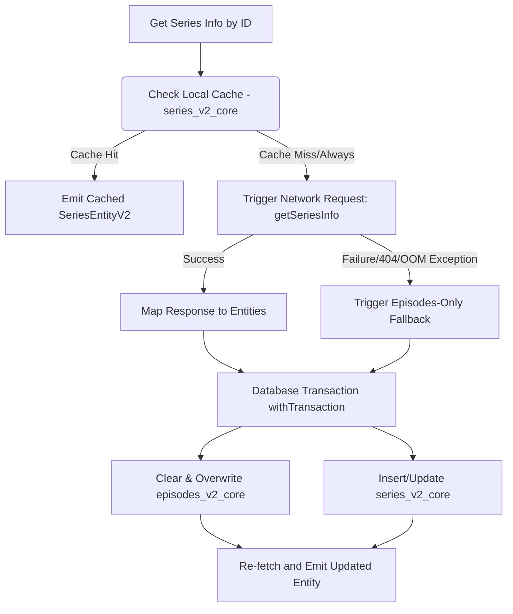

# IPTV Series Deep Audit Report

This report documents the findings of an ultra-deep technical audit of the IPTV Series module in the DebridXtream application. It details the structural architecture, browsing (V1) and details (V2) flows, state management, D-Pad/focus navigation mechanics, database schemas, hidden/inactive configurations, and architectural debt.

---

## 1. Executive Summary

The IPTV Series module exhibits a hybrid architecture:
1. **Browse/Grid Screen (V1):** Uses legacy Room schemas (`series_core`), repository accessors, and paging flows to display categories and browse grids.
2. **Details Screen (V2):** Uses newer V2 schemas (`series_v2_core` and `episodes_v2_core`), repositories, and horizontal paging flows for seasons and episodes.

While this split caching strategy ensures offline capability and modular details handling, it introduces architectural complexity and duplicate storage models. Additionally, key action UI elements (e.g., details action buttons) are currently hidden via XML configurations, causing functional limitations on the details page.

---

## 2. Directory Structure & Key Components

The codebase manages the IPTV Series feature across two main directories:

### UI & Presentation (V1 Browse Screen)
- **Path:** `app/src/main/java/com/tvonnet/debridxtreamiptv/ui/series/`
- **`SeriesFragment.kt`**: The entry fragment displaying categories sidebar and grid. Manages focus trapping, Lumina sidebar animation, and backdrop transitions.
- **`SeriesViewModel.kt`**: Manages UI state, selected category, and emits `pagedSeries` flow.
- **`SeriesPagingAdapter.kt`**: Submits `XtreamSeriesInfo` elements in a grid.
- **`SeriesSeasonAdapter.kt` & `SeriesEpisodeAdapter.kt`**: Legacy components retained but inactive due to V2 migration.

### Domain, Data & Details (V2 Engine)
- **Path:** `app/src/main/java/com/tvonnet/debridxtreamiptv/features/seriesv2/`
- **`XtreamSeriesRepositoryV2.kt`**: Single point of fetching and caching series info and episodes. Implements strategies for primary/fallback network parsing.
- **`SeriesDetailFragmentV2.kt`**: Displays the details screen, including title, plot, seasons horizontal bar, and episode cards.
- **`SeriesDetailViewModelV2.kt`**: Manages detail view states and handles season-filtering flow updates.
- **`EpisodesAdapterV2.kt` & `SeasonsAdapterV2.kt`**: Vertical/horizontal list adaptors tuned with null item animators to prevent TV focus jitter.

---

## 3. Data Cache & Sync Flow

The repository operations represent an offline-first strategy:



### Network Parse & Failures
1. **Fallback Strategy 1 (get_series):** Fetches the primary endpoint with `series_id` query parameter. If episodes are parsed successfully from here, they are cached directly.
2. **Fallback Strategy 2 (get_show_episodes):** If the primary series info endpoint returns 404 or throws a parse exception (due to dynamic provider JSON formatting), the repo fetches the episodes directly using `getSeriesEpisodes` and caches stub details.

---

## 4. D-Pad & TV Focus Navigation Mechanics

For TV interfaces, navigation stability is critical. The Series section implements several notable focus guardrails:

### Lumina Sidebar Width Animation
When focus shifts between the sidebar categories (`rv_categories_sidebar`) and the grid content (`rv_series_grid`), `SeriesFragment` dynamically expands/collapses the sidebar container width via a custom `ValueAnimator`:
```kotlin
val targetWidth = if (expanded) {
    resources.getDimensionPixelSize(R.dimen.sidebar_width_expanded)
} else {
    resources.getDimensionPixelSize(R.dimen.sidebar_width_collapsed)
}
// Animate width without shifting grid items
android.animation.ValueAnimator.ofInt(startWidth, targetWidth).apply {
    duration = 250
    interpolator = android.view.animation.DecelerateInterpolator()
    addUpdateListener { animator ->
        params.width = animator.animatedValue as Int
        llSidebarContainer.layoutParams = params
    }
    start()
}
```

### Grid Escape Guards
Custom `OnKeyListeners` prevent standard Android focus searches from escaping layout boundaries:
- **Left Sidebar Escape:** Consumes `DPAD_LEFT` events on the sidebar to lock focus internally.
- **Grid Left Transition:** Intercepts `DPAD_LEFT` on the first column of `rv_series_grid` to smoothly refocus the sidebar categories.
- **Top Row Escape:** Consumes `DPAD_UP` on the top row to prevent the focus from jumping to global top headers.

---

## 5. Architectural Debt & Structural Issues

During the deep audit, three major issues were identified:

### 1. Inactive/Hidden Action UI Container
In `fragment_series_detail_v2.xml`, the `container_actions` view group (containing the Play and Favorite buttons) is marked `visibility="gone"` and sized `0dp` by `0dp`:
```xml
<LinearLayout
    android:id="@+id/container_actions"
    android:layout_width="0dp"
    android:layout_height="0dp"
    android:visibility="gone"
    app:layout_start_of="parent"
    app:layout_constraintTop_toTopOf="parent">
    <Button android:id="@+id/btn_play" android:layout_width="0dp" android:layout_height="0dp" />
    <Button android:id="@+id/btn_favorite" android:layout_width="0dp" android:layout_height="0dp" />
</LinearLayout>
```
Because of this, players cannot watch series directly using a "Watch Now" action button on the details screen, nor can they toggle favorites from the detail view. The current implementation relies on clicking individual episode cards.

### 2. Disjointed Database Caching Models (V1 vs V2)
- **V1 Categories & Grid:** Query `series_core` table.
- **V2 Details & Episodes:** Query `series_v2_core` and `episodes_v2_core` tables.

There is no synchronization between these tables. If a series name changes or a favorite is marked in V1, the V2 detail view does not read the updated state natively without manual sync overrides. This results in duplicate caching logic and overhead storage consumption.

### 3. Inactive Repository Code
`XtreamSeriesRepositoryV2.getPagedSeries(categoryId)` is fully implemented with `SeriesRemoteMediatorV2` but remains unused because `SeriesFragment` is coupled to the V1 paging logic.

---

## 6. Recommendations & Next Steps

To modernize and resolve the highlighted issues:
1. **Restore Actions Layout:** Redesign the actions container in `fragment_series_detail_v2.xml` to present clean, TV-friendly action cards or buttons for "Play S1E1 / Resume" and "Add/Remove Favorite".
2. **Consolidate Caching Schemas:** Refactor category grids to query `series_v2_core`, deprecating the legacy V1 table to unify the database model.
3. **Harmonize Favorites Logic:** Ensure that toggling favorites updates both V1 and V2 tables atomically.
